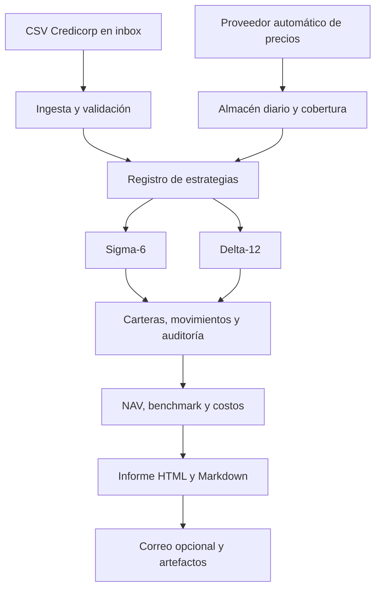

# Arquitectura extensible

## Responsabilidades

- `src/ingest_recommendations.py`: entrada incremental, deduplicación y archivo.
- `src/fetch_prices.py`: proveedor de mercado, normalización, reintentos, caché y cobertura.
- `src/strategy_engine.py`: implementaciones oficiales v2.
- `src/strategy_registry.py`: contrato y registro de estrategias presentes y futuras.
- `src/run_pipeline.py`: orquestación, estado, valoración, costos, benchmark e informes.
- `alphadata.py`: interfaz única para operación local y programada.

El estado y el historial son archivos explícitos y auditables. Ninguna estrategia debe leer datos posteriores a su fecha de señal. Cada estrategia futura debe incluir pruebas de calendario, elegibilidad, pesos, costos y ejecución.
