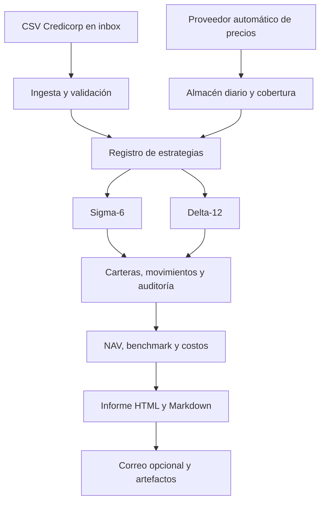

# Arquitectura extensible

## Responsabilidades

- `src/ingest_recommendations.py`: entrada incremental, deduplicación y archivo.
- `src/fetch_prices.py`: proveedor de mercado, normalización, reintentos, caché y cobertura.
- `src/strategy_engine.py`: implementaciones oficiales v2.
- `src/strategy_registry.py`: contrato y registro de estrategias presentes y futuras.
- `src/libro.py`: el libro de posiciones, que lo escribe producción en cada corrida.
- `src/run_pipeline.py`: orquestación, estado, valoración, costos, benchmark e informes.
- `alphadata.py`: interfaz única para operación local y programada.

El estado y el historial son archivos explícitos y auditables. Ninguna estrategia debe leer datos posteriores a su fecha de señal. Cada estrategia futura debe incluir pruebas de calendario, elegibilidad, pesos, costos y ejecución.

## El libro de posiciones y el NAV miden cosas distintas

`data/libro_posiciones.csv` guarda, por estrategia, desde cuándo está abierta
cada posición y a qué precio entró. `data/strategy_nav.csv` guarda el
rendimiento de cada cartera desde que arrancó el seguimiento en vivo.

**Los dos números no cuadran, y es por diseño.** Una posición puede mostrar
+22,9% mientras su estrategia muestra −0,2%: la primera es la ganancia no
realizada de un papel desde que se compró, la segunda es el rendimiento de una
cartera en un periodo. Son dos mediciones distintas, como en cualquier cartola.

La diferencia tiene tres fuentes, todas deliberadas:

1. **Periodos distintos.** ITAUCL viene desde el 27-02-2026; el NAV mide desde
   el 16-09-2026.
2. **La variación de la posición no descuenta la comisión de entrada.** El
   costo vive en el NAV, que es donde se paga una sola vez.
3. **El NAV pondera y rota.** Es el resultado de la cartera completa, incluidas
   las posiciones que ya se cerraron; la columna sólo mira las ocho vivas.

Encadenar las dos mediciones es exactamente lo que fabricó el +30,2% de
Delta-12 de septiembre de 2026. El libro no lleva ninguna columna de NAV y hay
una prueba que lo exige.
