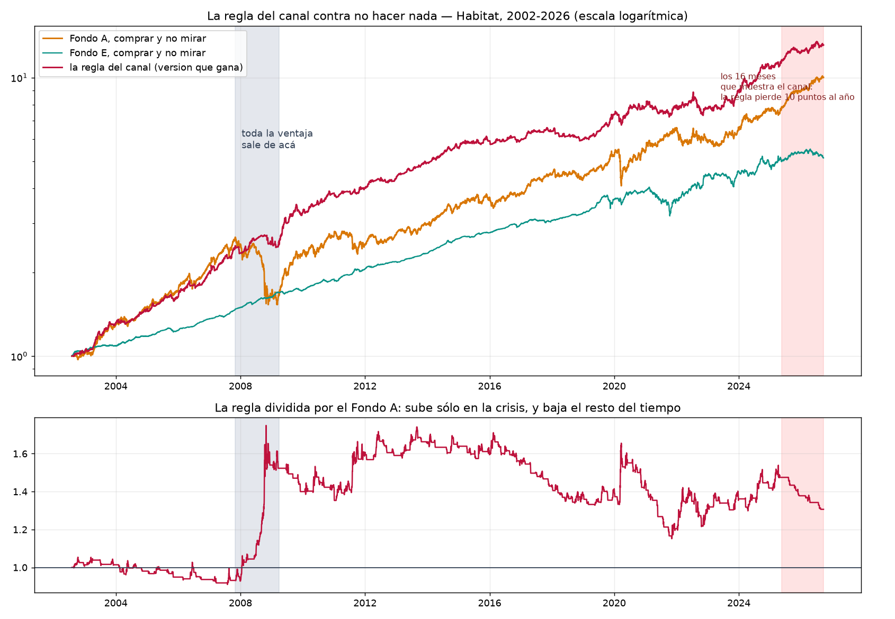

# ¿Puede el análisis técnico anticipar los cambios de fondo?

Respuesta corta: **no.** Y hay un dato que lo cierra sin discusión.

> **En los mismos 16 meses que muestra el gráfico del canal, la regla que esos
> gráficos implican habría rendido +9,48% anual contra +19,89% del Fondo A.
> Diez puntos y medio por año de menos, por estar cambiándose.**

Lo que sigue es cómo se llega ahí.

---

## Una aclaración de método, antes de nada

No sé cuál es la regla exacta del canal. **Reconstruí las tres series de las
imágenes, identifiqué qué transformación es cada una, y probé las reglas que
esos gráficos implican, en las dos direcciones y con los umbrales que están
dibujados.**

Pero hay un resultado —el de la sección 3— que **no depende de cuál sea su
regla**: si la posición dentro de las bandas no contiene información sobre lo
que viene, entonces ninguna regla construida sobre esas bandas puede funcionar,
en ninguna dirección y con ningún umbral.

## 1. Las tres imágenes, reproducidas

Con el valor cuota de Habitat, los números calzan:

| | la imagen muestra | reproducido |
|---|---|---|
| **imagen 1** — performance 16 meses | A ~+28%, E ~+2,5% | **+28,0% / +2,1%** |
| **imagen 2** — spread A/E en niveles | termina en ~24 | **25,9** |
| **imagen 3** — spread A/E oscilando | rango ~[−3%, +4%] | **[−3,03%, +4,85%]** |

La imagen 3 es la **variación de 20 días del cociente A/E**. Coincide el rango,
coincide la forma y coincide el número de cruces.

**Y hay un detalle que conviene ver.** La media de esa serie en esa ventana es
**+1,00%**, que es exactamente donde está dibujada la línea roja superior.

> La línea roja de +1% no marca un extremo. Marca el promedio.

Pasar del promedio hacia arriba ocurre la mitad del tiempo. Como umbral de
decisión, eso no separa nada.

## 2. La prueba que decide si las bandas significan algo

Las bandas de Bollinger suponen una cosa: que la serie **vuelve a su media**.
Si no vuelve, tocar la banda superior no anuncia una caída, es simplemente lo
que hace una serie que sube.

Prueba de estacionariedad (ADF):

| serie | p | |
|---|---:|---|
| spread en niveles — **imagen 2** | **0,197** | **NO estacionaria: tiene tendencia** |
| variación de 20 días — imagen 3 | 0,000 | estacionaria |

**La imagen 2 tiene bandas de Bollinger puestas sobre una serie con tendencia.**
El spread A/E acumulado sube 1,9 puntos al año en promedio y pasa el **56%** del
tiempo sobre su media móvil. Verlo pegado a la banda superior no es una señal de
nada: es el dibujo de una tendencia.

**La imagen 3 sí es un oscilador legítimo.** Ahí la pregunta tiene sentido, y se
puede contestar.

## 3. El resultado que cierra el tema

**%B** mide dónde está la serie dentro de sus bandas: 1 en la banda superior, 0
en la inferior. Si el indicador anticipara algo, %B alto tendría que predecir
que el Fondo A va a rendir **menos** que el E en adelante — o sea correlación
**negativa y grande**.

| horizonte | correlación con lo que viene | observaciones |
|---|---:|---:|
| 5 días | **+0,050** | 8.773 |
| 10 días | **+0,046** | 8.768 |
| 20 días | **+0,023** | 8.758 |
| 60 días | **+0,026** | 8.718 |

**Cero, y con el signo al revés del que haría falta.**

Sobre casi nueve mil observaciones, la posición dentro de las bandas no dice
nada sobre lo que viene. **Esto no descarta una regla en particular: descarta
todas las reglas construidas sobre esas bandas**, en cualquier dirección y con
cualquier umbral.

## 4. Las reglas medidas, por si queda duda

Desde 2002, con rezago de ejecución de 2 días corridos:

### Habitat

| regla | anual | peor caída | cambios/año |
|---|---:|---:|---:|
| reversión: banda alta → E | +8,12% | −29,68% | 10,7 |
| tendencia: banda alta → A | +8,76% | −28,89% | 10,6 |
| **líneas rojas: sobre +1% → E** | **+5,77%** | **−42,83%** | 11,3 |
| líneas rojas: sobre +1% → A | +11,21% | −17,50% | 11,3 |
| **comprar A y no mirar** | **+10,06%** | −42,71% | **0** |
| comprar E y no mirar | +6,89% | −21,18% | 0 |

### Cuprum

| regla | anual | peor caída | cambios/año |
|---|---:|---:|---:|
| reversión: banda alta → E | +7,13% | −40,31% | 9,9 |
| tendencia: banda alta → A | +9,52% | −19,74% | 9,9 |
| **líneas rojas: sobre +1% → E** | **+5,16%** | **−44,61%** | 10,7 |
| líneas rojas: sobre +1% → A | +11,65% | −17,33% | 10,7 |
| **comprar A y no mirar** | **+10,02%** | −44,00% | **0** |
| comprar E y no mirar | +6,72% | −20,81% | 0 |

**La lectura natural de una banda de Bollinger —arriba está caro, sal— es la
peor de todas.** Con las líneas rojas tal como están dibujadas, rinde +5,16% y
se come la caída completa del Fondo A, −44,61%. Lo peor de los dos mundos: el
retorno de la renta fija con el riesgo de la renta variable.

## 5. La única que gana, y de dónde sale

La versión contraria —quedarse en A cuando A viene ganando— sí le gana al Fondo
A en el total: +11,65% contra +9,98%, con la caída cortada a la mitad.

**Pero partida en pedazos deja de ser una estrategia:**

| tramo | la regla | Fondo A | diferencia |
|---|---:|---:|---:|
| 2002-2007 | +18,99% | +21,05% | **−2,06%** |
| **la crisis 2007-2009** | +0,81% | −28,82% | **+29,63%** |
| 2009-2013 | +15,27% | +13,22% | +2,05% |
| 2014-2019 | +6,91% | +9,78% | **−2,87%** |
| 2020 (covid) | +6,59% | +4,62% | +1,97% |
| 2021-2026 | +9,32% | +11,21% | **−1,90%** |
| **los 16 meses del canal** | **+9,48%** | **+19,89%** | **−10,41%** |

**Toda la ventaja de veinticuatro años sale de un solo episodio.** Fuera de
2008, la regla pierde en cuatro de los seis tramos restantes — incluido el que
el canal está mostrando ahora mismo.

Y la razón es simple: la regla pasa el **42% del tiempo fuera del Fondo A**. En
un mercado donde A le gana a E por 26 puntos en 16 meses, estar afuera casi la
mitad del tiempo cuesta exactamente lo que muestra la tabla.

## 6. Lo que sí es cierto, y conviene no tirarlo

**La protección es real.** La regla deja la peor caída en **−17,50%** contra
−42,71% del Fondo A. En 2008 hizo +0,81% mientras el Fondo A perdía 28,82%.

Eso coincide con todo lo demás que hemos medido en estos estudios: **lo que
sobrevive de las reglas de tiempo es la protección, nunca el retorno.** Pero se
paga con dos puntos anuales en los años normales, y los años normales son la
mayoría.

Si lo que buscas es esa protección, hay una forma de conseguirla que no exige
acertarle a nada: **la mezcla fija**. Estar 40% en A y 60% en E, reequilibrando
una vez al año, deja la peor caída en −15,0% con +8,05% anual — **mejor
protección que la regla y sin diez cambios al año ni un indicador que mirar**.
Está medido en `research/afp_investigacion/`.

## 7. Por qué esto era esperable

Tres piezas independientes ya apuntaban al mismo lugar:

- La **Superintendencia de Pensiones** midió que el **79,5%** de quienes se
  cambiaron de fondo rindieron peor que si se hubieran quedado.
- **El Fondo A ya trae su propia defensa adentro**: su exposición cambiaria sin
  cubrir tiene correlación −0,44 con la bolsa global, y hace que el fondo caiga
  sólo el **55%** de lo que cae la bolsa mundial. Cambiarse a E entrega eso.
- Nuestros dos estudios anteriores, con familias de reglas distintas, dieron el
  mismo patrón: **lo que funciona en una ventana falla en la otra.**

Esta prueba es la cuarta, sobre un indicador distinto, y da lo mismo.

## Y una advertencia sobre lo que se está mirando

El gráfico de la imagen 1 es correcto y es impresionante: el Fondo A hizo +28%
y el E hizo +2%. **Pero eso es el argumento para quedarse en A, no para
cambiarse.** Quien siguió una regla de cambios en esos mismos 16 meses se quedó
con menos de la mitad de esa ganancia.

Un gráfico de lo que hicieron los fondos no es evidencia de lo que hizo una
regla sobre los fondos. Son dos cosas distintas, y la segunda es la única que
importa para decidir.

---

Reproducir: `PYTHONPATH=. python research/afp_analisis_tecnico/estudio.py`
